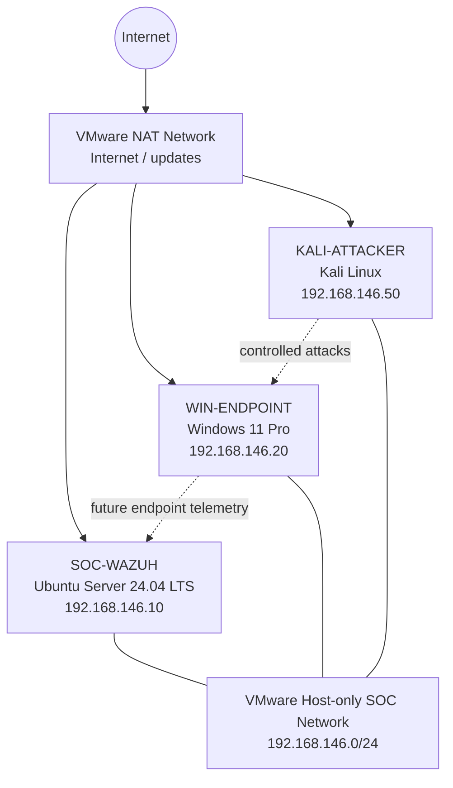

# Home SOC Lab

A practical, hands-on Security Operations Center (SOC) lab built in VMware Workstation 17 Player.

The goal of this project is to build a small but realistic blue-team environment where I can collect endpoint telemetry, centralize logs, create detections, simulate attacks, investigate alert  and document the complete process.

> **Current status:** The three base VMs and private SOC network are complete. Wazuh SIEM deployment is the next stage.

---

## Objectives

This lab is being built to practice:

- SOC architecture and network segmentation
- Windows and Linux endpoint monitoring
- SIEM deployment and management
- Windows Event Logs and Sysmon telemetry
- Wazuh agent deployment
- Controlled attack simulation from Kali Linux
- Detection engineering
- Alert triage and investigation
- MITRE ATT&CK mapping
- Network monitoring and IDS integration
- Incident-response workflows

The environment is being built in layers so each component can be tested before the next one is introduced.

---

## Current Architecture

Each VM has two virtual NICs:

| Adapter | Purpose |
|---|---|
| NAT | Internet access for updates and downloads |
| Host-only | Private SOC traffic, attacks, and monitoring |

The Kali attacker is intentionally **not bridged** onto the physical LAN.

---

## Host System

| Component | Configuration |
|---|---|
| Hypervisor | VMware Workstation 17 Player |
| CPU | Intel Core i7-12700H |
| Cores / logical processors | 14 / 20 |
| RAM | 16 GB |
| Free storage at start | ~610 GB |
| Hardware virtualization | Enabled |

Because the host has 16 GB RAM, VM allocations are kept conservative and not every VM is expected to run simultaneously at full load.

---

## Virtual Machines

| VM | OS | vCPU | RAM | Disk | Host-only IP | Role |
|---|---|---:|---:|---:|---|---|
| `SOC-WAZUH` | Ubuntu Server 24.04 LTS | 4 | 6 GB | 80 GB | `192.168.146.10` | SIEM server |
| `WIN-ENDPOINT` | Windows 11 Pro | 2 | ~5 GB | 60 GB | `192.168.146.20` | Monitored endpoint |
| `KALI-ATTACKER` | Kali Linux | 2 | ~2 GB | Prebuilt image | `192.168.146.50` | Attack simulator |

---

## Documentation

The full step-by-step build, including troubleshooting and screenshots, is here:

- [`docs/Lab-setup.md`](docs/Lab-setup.md)

---

## Safety

This lab is for authorized defensive-security practice. Controlled attack traffic should remain inside the private VMware Host-only network and should only target systems owned by or explicitly authorized for the lab operator.
