# SOC Lab Setup

This chapter documents the environment from an empty VMware setup through three installed and networked VMs.

At the end of this stage:

```text
SOC-WAZUH      192.168.146.10
WIN-ENDPOINT   192.168.146.20
KALI-ATTACKER  192.168.146.50
```

Wazuh itself has **not yet been installed**. The goal of this stage was to make the underlying infrastructure stable first.

---

## 1. Why infrastructure comes first

Installing a SIEM before the base VMs and networking work reliably makes troubleshooting unnecessarily difficult.

The lab was therefore built in layers:

1. Prepare the hypervisor.
2. Install/import each guest OS.
3. Verify each guest independently.
4. Add a private SOC network.
5. Assign stable addresses.
6. Test communication and firewalls.
7. Install the monitoring stack afterward.

This gives us a known-good checkpoint before Wazuh, agents, Sysmon or attack simulations are introduced.

---

## 2. Host preparation

The host system has:

- VMware Workstation 17 Player
- Intel Core i7-12700H
- 16 GB RAM
- Hardware virtualization enabled
- Approximately 610 GB free disk space when the lab was started

The main resource constraint is RAM, so the lab is designed so unnecessary VMs can be powered off when not needed.

### Images downloaded

- Ubuntu Server 24.04 LTS ISO
- Windows 11 ISO
- Kali Linux prebuilt VMware image

---

## 3. Create `SOC-WAZUH`

A new VM was created from the Ubuntu Server 24.04 LTS ISO.

### VM resources

```text
Name: SOC-WAZUH
RAM: 6 GB
vCPU: 4
Disk: 80 GB
Initial network: NAT
```

### Ubuntu installation choices

```text
Hostname: soc-wazuh
User: socadmin
OpenSSH server: enabled
Ubuntu Pro: skipped
Featured server snaps: none
```

OpenSSH was enabled so the server can later be administered from another machine instead of depending entirely on the VMware console.

Ubuntu installation progress:

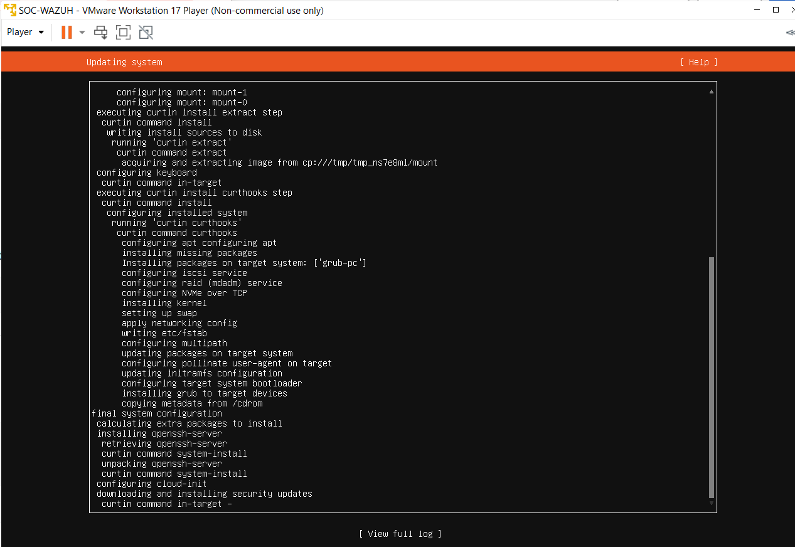

After installation, the first login confirmed the system was running correctly:

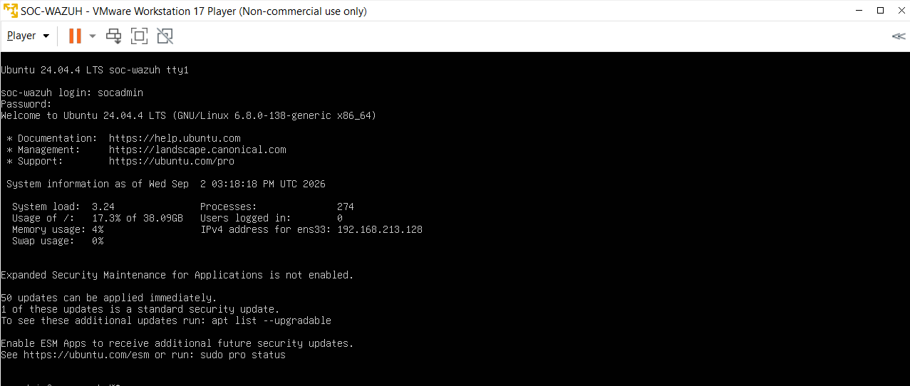

### Validate networking

```bash
hostname
ip a
ping -c 4 8.8.8.8
ping -c 4 google.com
```

The successful connectivity test confirmed both internet routing and DNS resolution:

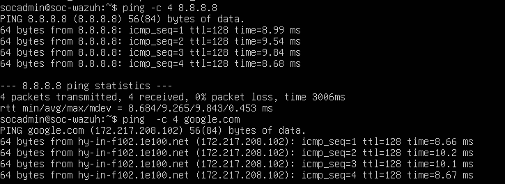

Ubuntu was then updated:

```bash
sudo apt update
sudo apt upgrade -y
```

---

## 4. Create `WIN-ENDPOINT`

A Windows 11 Pro VM was created to act as the primary monitored endpoint and future attack target.

### VM resources

```text
Name: WIN-ENDPOINT
vCPU: 2
RAM:  5 GB
Disk: 60 GB
Initial network: NAT
```

```text
Lab account: socuser
```

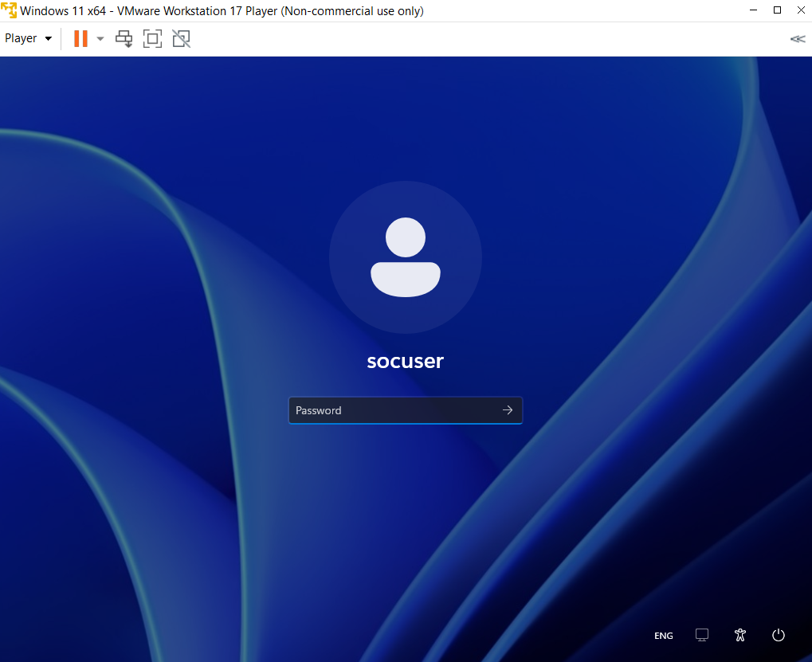

After Windows setup finished, the installation ISO was disconnected from automatic boot so the VM would start from its virtual disk instead of returning to setup.

## 5. Import `KALI-ATTACKER`

The official Kali prebuilt VMware image was extracted and opened through its `.vmx` configuration file.

The hostname was changed to:

```text
kali-attacker
```

A linux mouse integration issue was observed, but it did not block the project because the attacker VM can be operated primarily through the terminal.

---

# 6. Network design

Each VM initially had only a NAT adapter. A second **Host-only** adapter was added to all three machines.


The architecture is:

```text
Internet
   |
VMware NAT
   |
   +---------+---------+
   |         |         |
 Wazuh     Windows    Kali
   |         |         |
   +---- Host-only ----+
       SOC network
```

### NAT adapter

Used for:

- OS updates
- package installation
- downloading tools
- future Wazuh installation

### Host-only adapter

Used for:

- private attack traffic
- Wazuh agent/server communication
- internal SOC testing
- endpoint-to-endpoint traffic

### Why Kali is not bridged

Bridged networking would place Kali directly on the physical LAN and increases the risk of sending test traffic to non-lab systems. The private Host-only network keeps the attack surface bounded to the lab.

---

# 7. Discover the VMware subnets

After adding the second adapter to Ubuntu, `ip a` and `ip route` were used to distinguish the two interfaces.

The result was:

```text
ens33 -> NAT
ens37 -> Host-only
```

The NAT network used:

```text
192.168.213.0/24
```

The VMware Host-only network used:

```text
192.168.146.0/24
```

The default route pointed through `ens33`, proving it was the internet-facing NAT NIC.

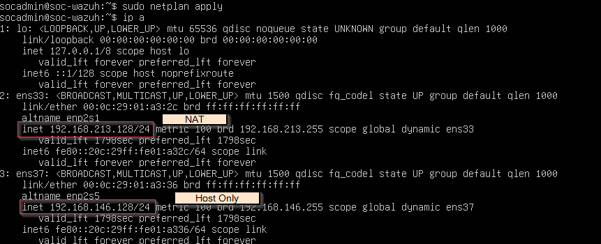

---

# 8. Ubuntu second NIC troubleshooting

The Host-only adapter initially existed in VMware but appeared as `DOWN` inside Ubuntu and had no IPv4 address.

The reason was that Netplan only knew about `ens33`.

The configuration was inspected:

```bash
sudo cat /etc/netplan/50-cloud-init.yaml
```

Initially:

```yaml
network:
  version: 2
  ethernets:
    ens33:
      dhcp4: true
```

`ens37` was added and temporarily allowed to use DHCP:

```yaml
network:
  version: 2
  ethernets:
    ens33:
      dhcp4: true
    ens37:
      dhcp4: true
```

Then:

```bash
sudo netplan try
sudo netplan apply
```

This allowed me to discover the actual Host-only subnet before assigning fixed addresses.

---

# 9. Give `SOC-WAZUH` a stable address

A SIEM server should not randomly change its address because agents and analysts need a stable destination.

The Host-only NIC was therefore configured as:

```yaml
network:
  version: 2
  ethernets:
    ens33:
      dhcp4: true
    ens37:
      dhcp4: false
      addresses:
        - 192.168.146.10/24
```

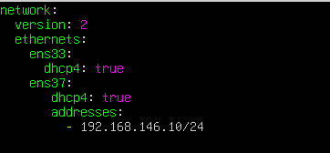

Apply:

```bash
sudo netplan try
sudo netplan apply
```

The fixed address was confirmed:

```text
SOC-WAZUH: 192.168.146.10/24
```

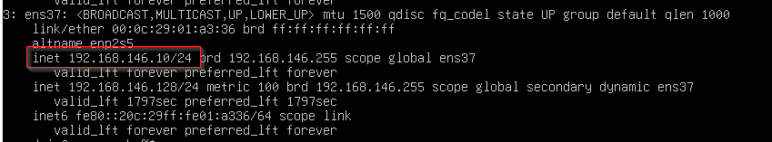

No default gateway or DNS server was configured on the Host-only NIC. Internet traffic must continue through the NAT NIC.

---

# 10. Give `WIN-ENDPOINT` a stable address

The Windows Host-only adapter was identified by its `192.168.146.x` address.

Its IPv4 properties were changed to:

```text
IP address:      192.168.146.20
Subnet mask:     255.255.255.0
Default gateway: blank
DNS:             blank
```

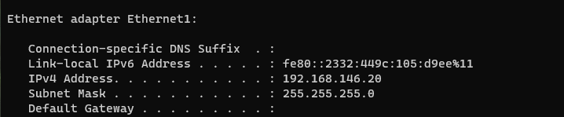

The absence of a gateway on the Host-only NIC is intentional. The NAT adapter remains responsible for internet connectivity.

---

# 11. Validate Windows -> Wazuh connectivity

From Windows:

```cmd
ping 192.168.146.10
```

The endpoint successfully reached the Wazuh server:

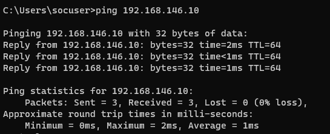

This confirmed that the private VMware network was working in at least one direction.

---

# 12. Troubleshoot Wazuh -> Windows ping

The reverse test initially failed:

```bash
ping -c 4 192.168.146.20
```

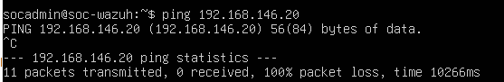

Because Windows could already reach Wazuh, this suggested a host firewall issue rather than a routing problem.

Windows Defender Firewall was blocking inbound ICMP echo requests.

The following inbound rule was enabled for the lab:

```text
File and Printer Sharing (Echo Request - ICMPv4-In)
```

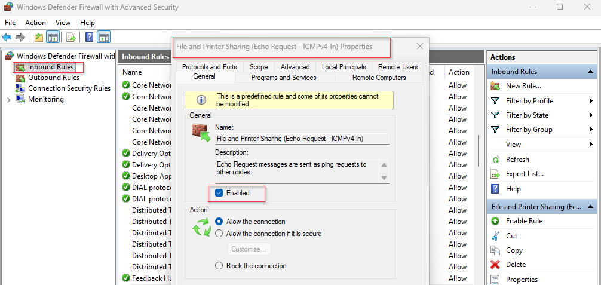

After enabling the rule, Wazuh could ping Windows successfully:

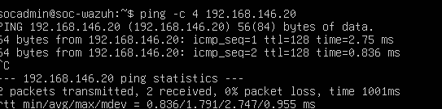


Note: Asymmetric ping results do not automatically mean the network is misconfigured. A guest firewall can permit outbound traffic while rejecting inbound probes.

---

# 13. Configure Kali networking

Kali had two active Ethernet interfaces after adding its Host-only NIC.

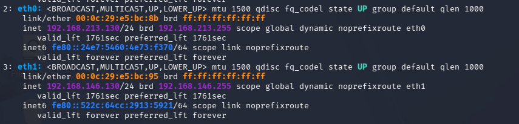

NetworkManager showed:

```text
eth0 -> Wired connection 1
eth1 -> Wired connection 2
```

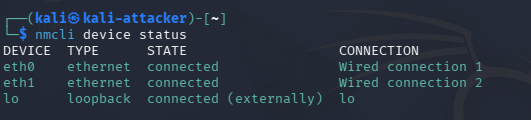

The second connection was the Host-only SOC interface.

It was changed to a fixed address:

```bash
sudo nmcli connection modify "Wired connection 2" \
  ipv4.method manual \
  ipv4.addresses 192.168.146.50/24 \
  ipv4.gateway "" \
  ipv4.dns ""
```

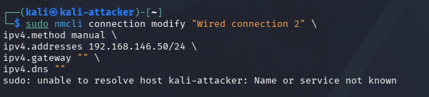

Then the connection was restarted:

```bash
sudo nmcli connection down "Wired connection 2"
sudo nmcli connection up "Wired connection 2"
```

The final configuration confirmed the fixed `192.168.146.50` Host-only address:

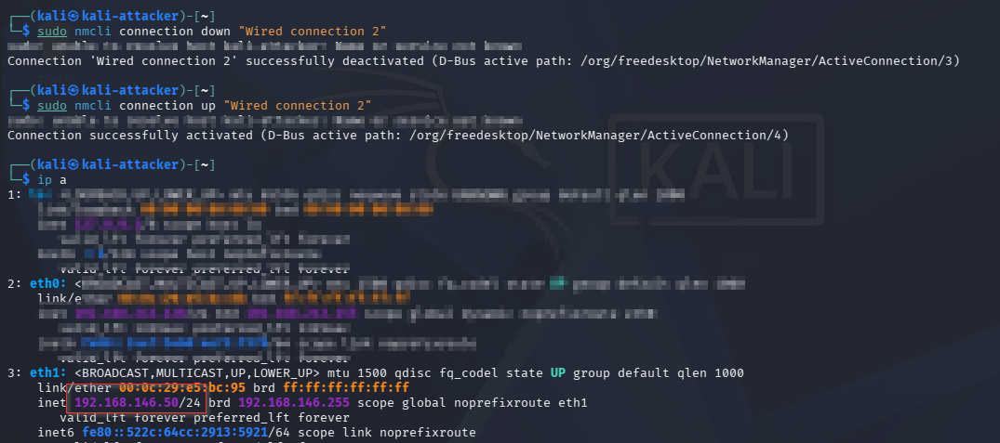

```
The base network is now complete.
```
---

