# 03 - Sysmon Telemetry and Wazuh Event Hunting

This chapter adds high-quality Windows telemetry to the lab using Sysmon and confirms that the complete pipeline is working:

```text
Windows activity
      |
      v
Sysmon
      |
      v
Windows Event Log
      |
      v
Wazuh Agent
      |
      v
Wazuh Manager
      |
      v
Wazuh Indexer
      |
      v
Wazuh Discover / Threat Hunting
```

At the end of this stage, `WIN-ENDPOINT` is producing Sysmon telemetry that can be searched from the Wazuh dashboard.

---

## 1. Goal of this stage

The Wazuh agent was already active on `WIN-ENDPOINT` but endpoint enrollment alone does not provide enough detail for realistic process-level investigations.

Sysmon was added to collect richer Windows activity such as:

- process creation
- network connections
- file creation
- registry activity
- image loads
- process access
- DNS queries

This gives the SOC enough context to reconstruct activity instead of only seeing high-level Windows events.

---

## 2. Download Sysmon

On `WIN-ENDPOINT`, Sysmon was downloaded from Microsoft Sysinternals (https://learn.microsoft.com/en-us/sysinternals/downloads/sysmon?utm_source=chatgpt.com) and extracted to:

```text
C:\Tools\Sysmon
```

The 64-bit executable used was:

```text
Sysmon64.exe
```

---

## 3. Download a Sysmon configuration

A dedicated Sysmon configuration was used rather than relying on a bare default installation.

The `sysmon-modular` (https://github.com/olafhartong/sysmon-modular?utm_source=chatgpt.com) configuration was saved as:

```text
C:\Tools\Sysmon\sysmonconfig.xml
```

The folder contained:

```text
C:\Tools\Sysmon\
├── Sysmon64.exe
└── sysmonconfig.xml
```

---

## 4. Install Sysmon

Open **PowerShell as Administrator**:

```powershell
cd C:\Tools\Sysmon
```

Install Sysmon with the configuration:

```powershell
.\Sysmon64.exe -accepteula -i .\sysmonconfig.xml
```

This installs the Sysmon service, driver, and monitoring configuration.

<p align="center">
  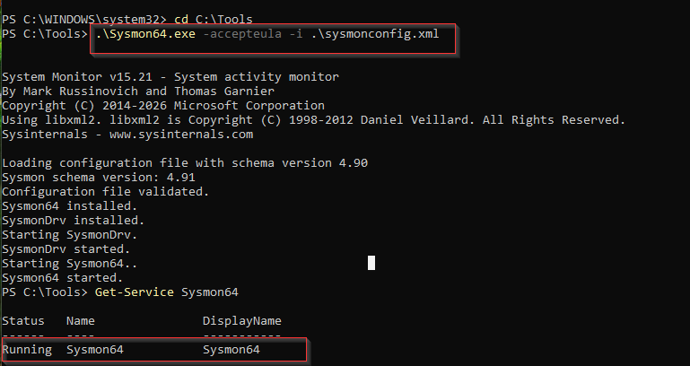
</p>

---

## 5. Verify the Sysmon service

Check the service:

```powershell
Get-Service Sysmon64
```

Expected:

```text
Running
```

---

## 6. Verify the Sysmon Event Log

Sysmon writes its events to:

```text
Microsoft-Windows-Sysmon/Operational
```

Check recent events:

```powershell
Get-WinEvent -LogName "Microsoft-Windows-Sysmon/Operational" -MaxEvents 5
```

Important Sysmon Event IDs for later investigations include:

| Event ID | Meaning |
|---:|---|
| 1 | Process creation |
| 3 | Network connection |
| 7 | Image loaded |
| 10 | Process access |
| 11 | File creation |
| 12 / 13 / 14 | Registry activity |
| 22 | DNS query |

---

## 7. Configure the Wazuh agent to collect Sysmon

The Windows Wazuh agent configuration is:

```text
C:\Program Files (x86)\ossec-agent\ossec.conf
```

Add this block **inside `<ossec_config>`**:

```xml
<localfile>
  <location>Microsoft-Windows-Sysmon/Operational</location>
  <log_format>eventchannel</log_format>
</localfile>
```

This subscribes the Wazuh agent to the Sysmon Operational Event Log.

<p align="center">
  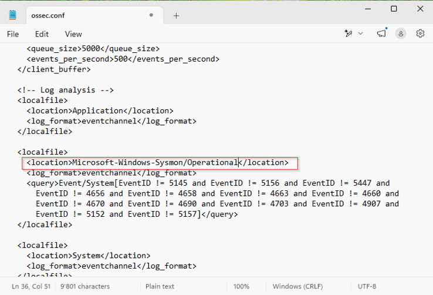
</p>

---

## 8. Restart the Wazuh agent

After saving `ossec.conf`:

```powershell
Restart-Service wazuhsvc
```

Verify:

```powershell
Get-Service wazuhsvc
```

Expected:

```text
Running
```

The collection path is now:

```text
Sysmon
  -> Windows Event Log
  -> Wazuh Agent
  -> Wazuh Manager
```

---

## 9. Why normal activity may not appear under Alerts

A key lesson from this stage was the difference between **telemetry** and **alerts**. A process can create a valid Sysmon event without triggering a Wazuh rule.

Therefore:

```text
Sysmon event != Wazuh alert
```

The main Wazuh alert view only shows events that matched detection rules. For threat hunting and validation, raw archived events are also needed.

---

## 10. Enable Wazuh JSON archives

On `SOC-WAZUH`:

```bash
sudo nano /var/ossec/etc/ossec.conf
```

Inside the `<global>` section, JSON archive logging was enabled:

```xml
<global>
  <jsonout_output>yes</jsonout_output>
  <alerts_log>yes</alerts_log>
  <logall_json>yes</logall_json>
</global>
```

Restart the manager:

```bash
sudo systemctl restart wazuh-manager
```

`logall_json` allows Wazuh to retain JSON-formatted events even when they do not generate an alert.

<p align="center">
  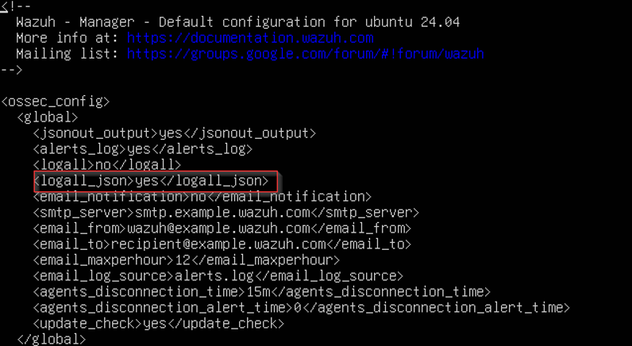
</p>

---

## 11. Enable Filebeat archive indexing

Edit:

```bash
sudo nano /etc/filebeat/filebeat.yml
```

Configure the Wazuh module so archive events are also indexed:

```yaml
filebeat.modules:
  - module: wazuh
    alerts:
      enabled: true
    archives:
      enabled: true
```

Restart Filebeat:

```bash
sudo systemctl restart filebeat
```

Check:

```bash
sudo systemctl is-active filebeat
```

Expected:

```text
active
```

Optional connection test:

```bash
sudo filebeat test output
```

<p align="center">
  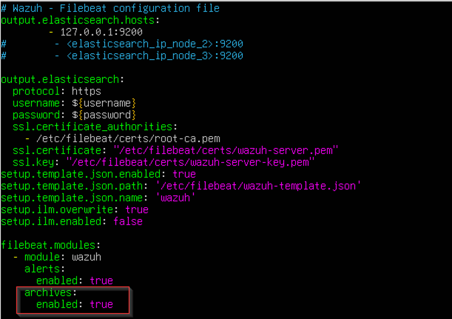
</p>

---

## 12. Create the `wazuh-archives-*` data view / index pattern

In the Wazuh dashboard, create:

```text
wazuh-archives-*
```

Use this time field:

```text
timestamp
```

This makes raw endpoint telemetry searchable in Discover even when no Wazuh rule fires.

<p align="center">
  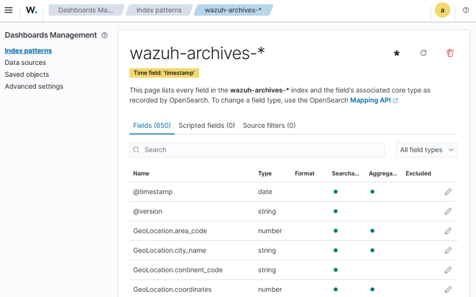
</p>

---

## 13. Search Sysmon events in Discover

Use:

```text
Wazuh Dashboard
  -> Explore
  -> Discover
  -> wazuh-archives-*
```

First filter to the endpoint:

```text
agent.name:"WIN-ENDPOINT"
```

Search for Sysmon process creation:

```text
agent.name:"WIN-ENDPOINT" AND data.win.system.eventID:"1"
```

To narrow to a particular executable:

```text
agent.name:"WIN-ENDPOINT" AND data.win.system.eventID:"1" AND data.win.eventdata.image:*cmd.exe
```

Another useful field is:

```text
data.win.eventdata.commandLine
```

Example:

```text
data.win.eventdata.commandLine:*whoami*
```

---

## 14. Validate locally before troubleshooting Wazuh

When testing whether an event reached Wazuh, first confirm Sysmon generated it locally:

```powershell
Get-WinEvent -LogName "Microsoft-Windows-Sysmon/Operational" -MaxEvents 20 |
Where-Object {$_.Id -eq 1} |
Select-Object TimeCreated, Id, Message
```

This separates two failure points:

```text
No local Sysmon event
        |
        +--> Sysmon/configuration problem

Local event exists
but not in Wazuh
        |
        +--> Wazuh ingestion/indexing problem
```

---

## 15. Test process creation

A deterministic process-creation test is:

```powershell
cmd.exe /c whoami
```

<p align="center">
  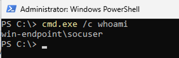
</p>

Then verify it locally:

```powershell
Get-WinEvent -LogName "Microsoft-Windows-Sysmon/Operational" -MaxEvents 20 |
Where-Object {$_.Id -eq 1} |
Select-Object TimeCreated, Id, Message
```

Then search Wazuh Discover:

```text
agent.name:"WIN-ENDPOINT" AND data.win.system.eventID:"1"
```

Optionally:

```text
data.win.eventdata.commandLine:*whoami*
```

---

## 16. Final validation

This stage is successful when the same activity can be followed through the full pipeline:

```text
1. Execute a process on WIN-ENDPOINT
          |
          v
2. Sysmon generates Event ID 1
          |
          v
3. Event appears in Microsoft-Windows-Sysmon/Operational
          |
          v
4. Wazuh agent collects the event
          |
          v
5. Wazuh manager receives it
          |
          v
6. Filebeat indexes archive telemetry
          |
          v
7. Event is searchable in Discover
```

This confirms the Windows telemetry pipeline is working as expected.

The final Wazuh Discover view showed Sysmon Event ID `1` records from `WIN-ENDPOINT`, including the `whoami.exe` and `cmd.exe` process activity:

<p align="center">
  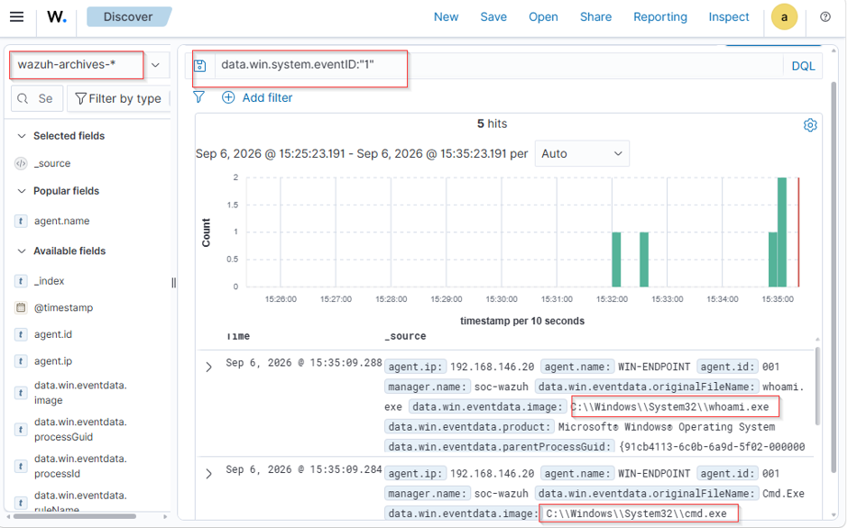
</p>

---

## 17. Alerts vs Archives

The lab now has two useful views:

```text
Incoming event
     |
     v
Does it match a Wazuh rule?
     |
  +--+--+
  |     |
 Yes    No
  |     |
  v     v
Alerts  Archives
```

### Alerts

Stored under:

```text
wazuh-alerts-*
```

Useful for:

- rule-triggered detections
- triage
- prioritization
- investigating suspicious activity

### Archives

Stored under:

```text
wazuh-archives-*
```

Useful for:

- raw telemetry
- threat hunting
- process reconstruction
- validating collection
- investigations where no alert fired

An analyst should not assume an event did not occur simply because it did not generate an alert.

---

## 18. Optional retention / cleanup

Archive data grows much faster than alert data because it contains raw events.

For this 80 GB lab server, a sensible starting target is:

```text
Raw archives: 7 days
Alerts:       30 days
```

A future Index State Management policy can automatically remove old:

```text
wazuh-archives-*
```

indices.

This is an operational housekeeping step rather than part of the telemetry-validation path itself.

The archive retention policy was configured with the following settings:

<p align="center">
  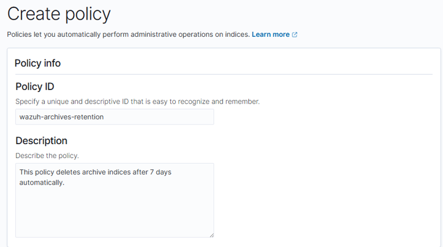
</p>

<p align="center">
  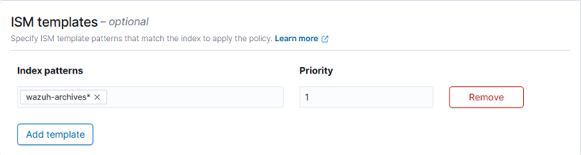
</p>

<p align="center">
  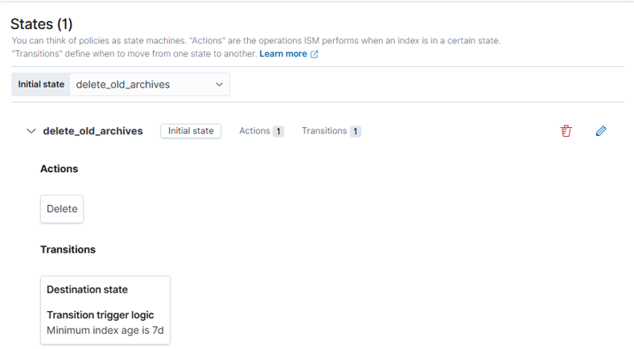
</p>

---

## 19. Current architecture

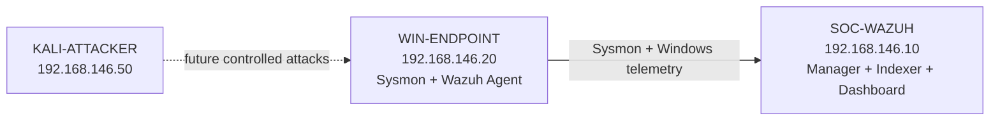

---
