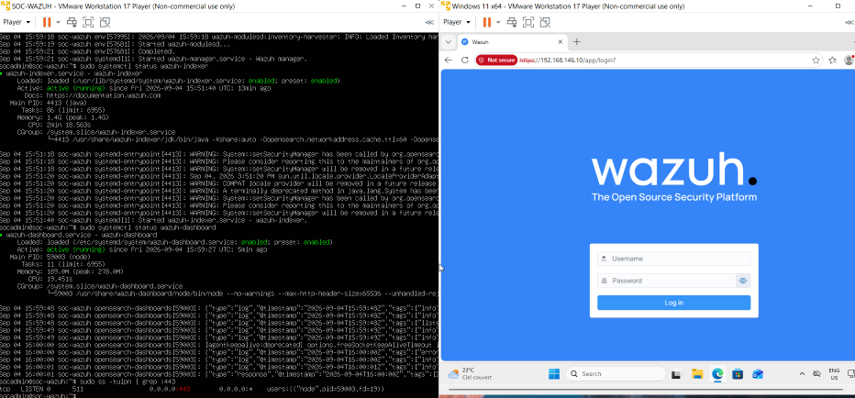
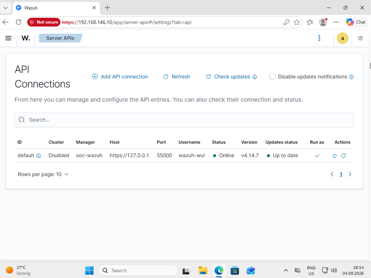
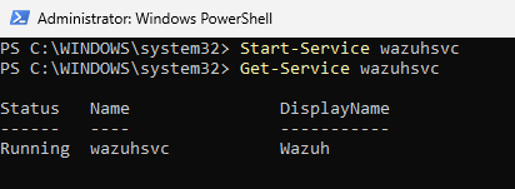
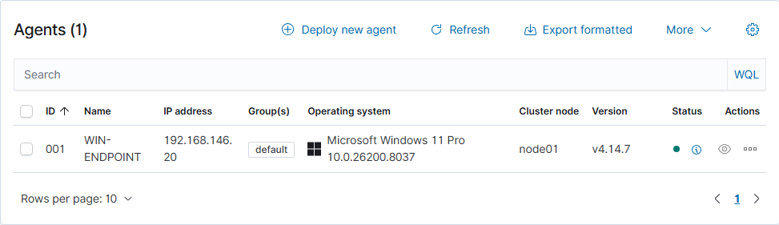
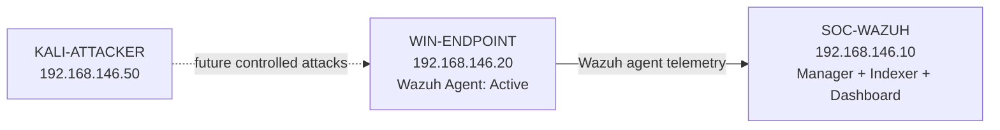

# Wazuh SIEM Deployment and Windows Agent Enrollment

This chapter documents the deployment of the Wazuh all-in-one stack on `SOC-WAZUH` and enrollment of `WIN-ENDPOINT` as the first monitored agent.

At the end of this stage:

```text
SOC-WAZUH
  Wazuh Manager      running
  Wazuh Indexer      running
  Wazuh Dashboard    running

WIN-ENDPOINT
  Wazuh Agent        running
  Agent status       Active
```

## 1. Prepare the Wazuh server

Only the systems needed for this stage were powered on:

```text
SOC-WAZUH
WIN-ENDPOINT
```

Kali was kept powered off to reduce RAM usage on the 16 GB host.

Internet access was verified:

```bash
ping -c 4 google.com
```

Then Ubuntu was updated:

```bash
sudo apt update
sudo apt upgrade -y
sudo reboot
```

---

## 2. Install the Wazuh all-in-one stack

On `SOC-WAZUH`:

```bash
curl -sO https://packages.wazuh.com/4.14/wazuh-install.sh
sudo bash ./wazuh-install.sh -a
```

The `-a` option deploys the central Wazuh components on the same VM:

```text
Wazuh Manager
Wazuh Indexer
Wazuh Dashboard
```

This layout is appropriate for a small home SOC lab because it keeps the deployment simple while still exposing the main Wazuh workflow.

### Credential handling

The installer generates an administrative username (admin) and password. That password should be stored privately.

---

## 3. Verify the Wazuh services

The core services were checked with:

```bash
sudo systemctl status wazuh-manager
sudo systemctl status wazuh-indexer
sudo systemctl status wazuh-dashboard
```

The expected state for each service was:

```text
active (running)
```

The HTTPS listener was also verified:

```bash
sudo ss -tulpn | grep :443
```

The output showed a listener on:

```text
0.0.0.0:443
```

This confirmed that the dashboard was available over HTTPS.

---

## 4. Open the Wazuh dashboard

From `WIN-ENDPOINT`, the dashboard was opened at:

```text
https://192.168.146.10
```

The browser displayed a certificate warning because the lab certificate is not trusted by default. For this isolated lab, the warning was accepted.



After login, the Server APIs page showed the local API connection online:

```text
Manager: soc-wazuh
Host: https://127.0.0.1
Port: 55000
Status: Online
Version: v4.14.7
```



---

## 5. Deploy the Windows Wazuh agent

From the Wazuh dashboard:

```text
Agents management
  -> Deploy new agent
```

The deployment settings used were:

```text
Operating system: Windows
Wazuh server address: 192.168.146.10
Agent name: WIN-ENDPOINT
```

The Windows MSI package used was:

```text
wazuh-agent-4.14.7-1.msi
```

The package was downloaded to `WIN-ENDPOINT` and installed from **Administrator PowerShell**.

```powershell
cd $env:USERPROFILE\Downloads
```

Then:

```powershell
msiexec.exe /i .\wazuh-agent-4.14.7-1.msi /q `
  WAZUH_MANAGER="192.168.146.10" `
  WAZUH_AGENT_NAME="WIN-ENDPOINT"
```

---

## 6. Verify the Windows agent configuration

The Wazuh agent configuration file is located at:

```text
C:\Program Files (x86)\ossec-agent\ossec.conf
```

The manager section should contain:

```xml
<client>
  <server>
    <address>192.168.146.10</address>
    <port>1514</port>
    <protocol>tcp</protocol>
  </server>

  <config-profile>windows, windows10</config-profile>
  <crypto_method>aes</crypto_method>
  <notify_time>20</notify_time>
  <time-reconnect>60</time-reconnect>
  <auto_restart>yes</auto_restart>
</client>
```

The important value is:

```xml
<address>192.168.146.10</address>
```

which points the Windows agent to the Wazuh manager on the private SOC network.


---

## 7. Start the Windows Wazuh service

After correcting `ossec.conf`:

```powershell
Start-Service wazuhsvc
```

Then:

```powershell
Get-Service wazuhsvc
```

Final result:

```text
Running  wazuhsvc  Wazuh
```



---

## 8. Verify the endpoint in Wazuh

Back in:

```text
Agents management
  -> Summary
```

the Windows endpoint appeared as active:

```text
ID: 001
Name: WIN-ENDPOINT
IP: 192.168.146.20
Operating system: Microsoft Windows 11 Pro
Version: v4.14.7
Status: Active
```



This is the main validation point for this stage: Wazuh is running and the first endpoint is successfully connected.

---

## 9. Final architecture after this stage



---
## 10. Issues Encountered and Fixes
After installation:

```powershell
Get-Service wazuhsvc
```

showed that the service now existed, but it was stopped. Wazuh would not stay running.

The service configuration was inspected:

```powershell
sc.exe qc wazuhsvc
```

The binary path confirmed the agent install location:

```text
C:\Program Files (x86)\ossec-agent\wazuh-agent.exe
```

The agent configuration file was then inspected:

```text
C:\Program Files (x86)\ossec-agent\ossec.conf
```

The issue was found in the `<client>` section:

```xml
<address>0.0.0.0</address>
```

This was changed to the actual Wazuh manager address:

```xml
    <address>192.168.146.10</address>
  
```

This was the key fix: the MSI had installed the agent service, but the manager address in `ossec.conf` was incorrect.

---

